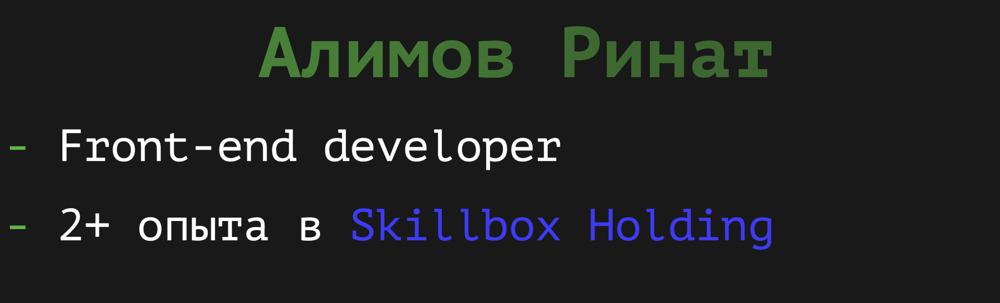

  
  

---

### Getting started
- 🚀 [Install reveal.js](https://revealjs.com/installation)
- 👀 [View the demo presentation](https://revealjs.com/demo)
- 📖 [Read the documentation](https://revealjs.com/markup/)
- 🖌 [Try the visual editor for reveal.js at Slides.com](https://slides.com/)
- 🎬 [Watch the reveal.js video course (paid)](https://revealjs.com/course)

--- 

  MIT licensed | Copyright © 2011-2024 Hakim El Hattab, https://hakim.se

